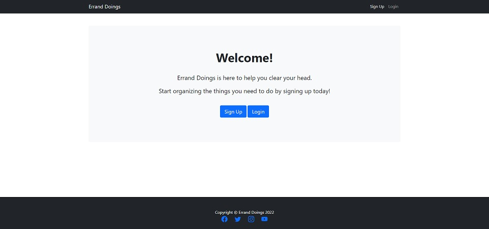
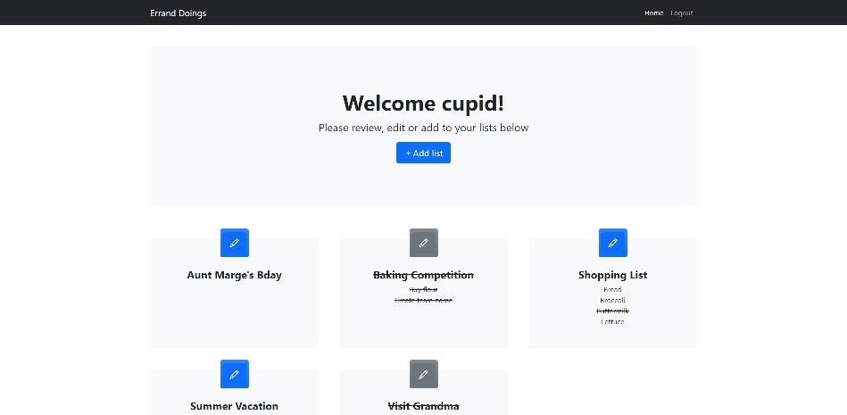
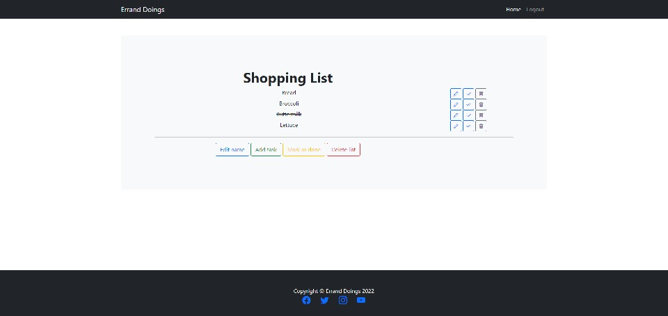
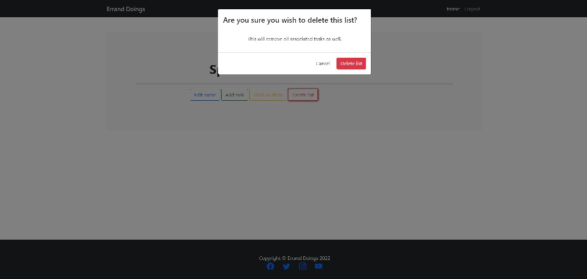
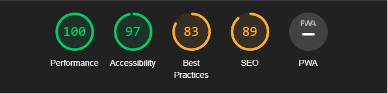

# Errand Doings
  [Errand Doings](https://errand-doings.herokuapp.com/) is a task management site that allows the user to create, update and delete lists and list items.

  
## UX Design  
### User stories
* As a user I can create an account  
* As a user I can view an overview of my lists and list items
* As a user I can create new lists and/or list items
* As a user I can edit existing lists and/or list items
* As a user I can delete lists and/or list items
* As a user I can mark a list and/or list item as finished

### Site goals
* The site is meant to help organize (large) tasks by allowing the user to note down individual elements that need to be tackled.
* By allowing a user to organize and note down necessary tasks the site is meant to aid a user in keeping an easy overview and relieve stress.

## Features  
### Existing features
*  A new user will be welcomed by the general welcome screen.  
  

* New users will be offered the option to either sign up or login.  
* Once logged in the user will be welcomed into their personal list overview.  
  

* The user can add new lists on the main page and edit list names, add tasks, mark lists or tasks as finished and delete tasks or lists on the edit page.  
  

* Although tasks can be deleted directly, there is a safety feature to ensure a user really wants to delete a complete list before deletion.  
  

### Potential future features  
* Add deadlines to tasks
* Add contacts / friends and be able to assign them tasks in order to for example organize large events or keep up a household cleaning schedule

## Technologies used  
* Python3
* HTML
* CSS
* [Django](https://www.djangoproject.com/)
* [Bootstrap](https://getbootstrap.com/)
* [GitHub](https://www.github.com)
* [Gitpod](https://www.gitpod.io)
* [Heroku](https://www.heroku.com)  

## Testing  
I have manually tested this project by doing the following:  
* Passed the code through a [Pep8](http://pep8online.com/) linter and confirmed there are no problems.
* Create random test lists, tasks and users.
* Pass the lighthouse test in developer tools:  
  

### User testing:
* As a user I can create an account:  
account creation works as expected. 
* As a user I can view an overview of my lists and list items:  
the home (or main) page shows all created lists from that particular user.
* As a user I can create new lists and/or list items:  
the add list and add task functions works as expected.
* As a user I can edit existing lists and/or list items:  
editing existing lists and tasks works as expected and redirects the user back to that list's page.
* As a user I can delete lists and/or list items:  
deleting of a task is instantenous and works as expected, deleting of a list gives a pop up window asking confirmation and works as expected.
* As a user I can mark a list and/or list item as finished:  
each individual task can be toggled to show as finished. The list can also be marked as done, in which case all associated tasks will automatically be marked as finished.  

### Bugs 
Some of the more prominent bugs were: 
* Solved bugs  
  * 'django.db.utils.OperationalError: FATAL: role "somerandomletters" does not exist'  
  Fixing this required the terminal command: unset PGHOSTADDR  
  * The CSS wasn't rendering properly.  
  This was fixed with the help of [csestack.org](https://www.csestack.org/add-css-static-files-django/d)
  * Redirecting to any page other than the homepage kept throwing an error.  
  This was fixed with the help of [Stack Overflow](https://stackoverflow.com/) in order to remain on the same page, and with the help of [Daniel Callaghan](https://github.com/xiaoniuniu89) in order to redirect to a page that ends with an id number (many thanks for the f-string tip!).  
  * Add list function no longer worked after having created the sign-up/login/user system.  
  Due to changing the model by adding in a user the form no longer worked, since the user id was now required but not specified. This was fixed inside the view with the help of [Stack Overflow](https://stackoverflow.com/).  
  
* Unsolved bugs  
  * To my knowledge no unsolved bugs remain.

## Deployment
This project was deployed using Code Institute's mock terminal for Heroku.  
* Steps for deployment:
   * Sign into Heroku
   * Choose New.
   * Choose Create new app.
   * Type in a name for your new app.
   * Select your region from the dropdown menu.
   * Choose Create App.
   * In the settings tab choose config vars.
   * Add the key: PORT with value: 8000.
   * Link up Heroku Postgres.
   * In the deploy tab, select GitHub as the deployment method and connect your GitHub profile.
   * Search for the repository that you wish to deploy to Heroku and click "connect".
   * Choose to automatically deploy and update your app.
   * Click on Deploy

The deployed version can be found here: [Errand Doings](https://errand-doings.herokuapp.com/)

## Credits
[Code Institute](https://www.codeinstitute.net)  
My mentor [5pence](https://github.com/5pence)  
[Bootstrap Template](https://startbootstrap.com/template/heroic-features)

Useful pages were:  
[Slack](https//:www.slack.com)  
[Stack Overflow](https://stackoverflow.com/)
